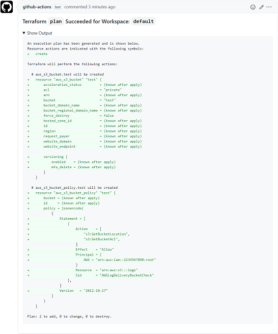

# Terraform PR Commenter

Adds opinionated comments to PR's based on Terraform `fmt`, `init` and `plan` outputs.

## Summary

This Docker-based GitHub Action is designed to work in tandem with [hashicorp/setup-terraform](https://github.com/hashicorp/setup-terraform) with the wrapper enabled, taking the output from a `fmt`, `init` or `plan`, formatting it and adding it to a pull request. Any previous comments from this Action are removed to keep the PR timeline clean.

Support (for now) is [limited to Linux](https://help.github.com/en/actions/creating-actions/about-actions#types-of-actions) as Docker-based GitHub Actions can only be used on Linux runners.

## Usage

This action can only be run after a Terraform `fmt`, `init`, or `plan` has completed, and the output has been captured. Terraform rarely writes to `stdout` and `stderr` in the same action, so we concatenate the `commenter_input`:

```yaml
- uses: robburger/terraform-pr-commenter@v1
  env:
    GITHUB_TOKEN: ${{ secrets.GITHUB_TOKEN }}
  with:
    commenter_type: fmt/init/plan # Choose one
    commenter_input: ${{ format('{0}{1}', steps.step_id.outputs.stdout, steps.step_id.outputs.stderr) }}
    commenter_exitcode: ${{ steps.step_id.outputs.exitcode }}
```

### Inputs

| Name                 | Requirement | Description                                           |
| -------------------- | ----------- | ----------------------------------------------------- |
| `commenter_type`     | _required_  | The type of comment. Options: [`fmt`, `init`, `plan`] |
| `commenter_input`    | _required_  | The comment to post from a previous step output.      |
| `commenter_exitcode` | _required_  | The exit code from a previous step output.            |

### Environment Variables

| Name                     | Requirement | Description                                                                                                                                               |
| ------------------------ | ----------- | --------------------------------------------------------------------------------------------------------------------------------------------------------- |
| `GITHUB_TOKEN`           | _required_  | Used to execute API calls. The `${{ secrets.GITHUB_TOKEN }}` already has permissions, but if you're using your own token, ensure it has the `repo` scope. |
| `TF_WORKSPACE`           | _optional_  | Default: `default`. This is used to separate multiple comments on a pull request in a matrix run.                                                         |
| `EXPAND_SUMMARY_DETAILS` | _optional_  | Default: `true`. This controls whether the comment output is collapsed or not.                                                                            |
| `HIGHLIGHT_CHANGES`      | _optional_  | Default: `true`. This switches `~` to `!` in `plan` diffs to highlight Terraform changes in orange. Set to `false` to disable.                            |

Both of these environment variables can be set at `job` or `step` level. For example, you could collapse all outputs but expand on a `plan`:

```yaml
jobs:
  terraform:
    name: 'Terraform'
    runs-on: ubuntu-latest
    env:
      EXPAND_SUMMARY_DETAILS: 'false' # All steps will have this environment variable
    steps:
      - name: Checkout
        uses: actions/checkout@v2
---
- name: Post Plan
  uses: robburger/terraform-pr-commenter@v1
  env:
    GITHUB_TOKEN: ${{ secrets.GITHUB_TOKEN }}
    EXPAND_SUMMARY_DETAILS: 'true' # Override global environment variable; expand details just for this step
  with:
    commenter_type: plan
    commenter_input: ${{ format('{0}{1}', steps.plan.outputs.stdout, steps.plan.outputs.stderr) }}
    commenter_exitcode: ${{ steps.plan.outputs.exitcode }}
```

## Examples

Single workspace build, full example:

```yaml
name: 'Terraform'

on:
  pull_request:
  push:
    branches:
      - master

jobs:
  terraform:
    name: 'Terraform'
    runs-on: ubuntu-latest
    steps:
      - name: Checkout
        uses: actions/checkout@v2

      - name: Setup Terraform
        uses: hashicorp/setup-terraform@v1
        env:
          TF_IN_AUTOMATION: true
        with:
          cli_config_credentials_token: ${{ secrets.TF_API_TOKEN }}
          terraform_version: 0.14.5

      - name: Terraform Format
        id: fmt
        run: terraform fmt -check -recursive
        continue-on-error: true

      - name: Post Format
        if: always() && github.ref != 'refs/heads/master' && (steps.fmt.outcome == 'success' || steps.fmt.outcome == 'failure')
        uses: robburger/terraform-pr-commenter@v1
        env:
          GITHUB_TOKEN: ${{ secrets.GITHUB_TOKEN }}
        with:
          commenter_type: fmt
          commenter_input: ${{ format('{0}{1}', steps.fmt.outputs.stdout, steps.fmt.outputs.stderr) }}
          commenter_exitcode: ${{ steps.fmt.outputs.exitcode }}

      - name: Terraform Init
        id: init
        run: terraform init

      - name: Post Init
        if: always() && github.ref != 'refs/heads/master' && (steps.init.outcome == 'success' || steps.init.outcome == 'failure')
        uses: robburger/terraform-pr-commenter@v1
        env:
          GITHUB_TOKEN: ${{ secrets.GITHUB_TOKEN }}
        with:
          commenter_type: init
          commenter_input: ${{ format('{0}{1}', steps.init.outputs.stdout, steps.init.outputs.stderr) }}
          commenter_exitcode: ${{ steps.init.outputs.exitcode }}

      - name: Terraform Plan
        id: plan
        run: terraform plan -out workspace.plan

      - name: Post Plan
        if: always() && github.ref != 'refs/heads/master' && (steps.plan.outcome == 'success' || steps.plan.outcome == 'failure')
        uses: robburger/terraform-pr-commenter@v1
        env:
          GITHUB_TOKEN: ${{ secrets.GITHUB_TOKEN }}
        with:
          commenter_type: plan
          commenter_input: ${{ format('{0}{1}', steps.plan.outputs.stdout, steps.plan.outputs.stderr) }}
          commenter_exitcode: ${{ steps.plan.outputs.exitcode }}

      - name: Terraform Apply
        id: apply
        if: github.ref == 'refs/heads/master' && github.event_name == 'push'
        run: terraform apply workspace.plan
```

Multi-workspace matrix/parallel build:

```yaml
...
jobs:
  terraform:
    name: 'Terraform'
      runs-on: ubuntu-latest
      strategy:
        matrix:
          workspace: [audit, staging]
      env:
        TF_WORKSPACE: ${{ matrix['workspace'] }}
      steps:
        - name: Checkout
          uses: actions/checkout@v2

        - name: Setup Terraform
          uses: hashicorp/setup-terraform@v1
          env:
            TF_IN_AUTOMATION: true
          with:
            cli_config_credentials_token: ${{ secrets.TF_API_TOKEN }}
            terraform_version: 0.14.5

        - name: Terraform Init - ${{ matrix['workspace'] }}
          id: init
          run: terraform init

        - name: Post Init - ${{ matrix['workspace'] }}
          if: always() && github.ref != 'refs/heads/master' && (steps.init.outcome == 'success' || steps.init.outcome == 'failure')
          uses: robburger/terraform-pr-commenter@v1
            env:
              GITHUB_TOKEN: ${{ secrets.GITHUB_TOKEN }}
            with:
              commenter_type: init
              commenter_input: ${{ format('{0}{1}', steps.init.outputs.stdout, steps.init.outputs.stderr) }}
              commenter_exitcode: ${{ steps.init.outputs.exitcode }}

        - name: Terraform Plan - ${{ matrix['workspace'] }}
          id: plan
          run: terraform plan -out ${{ matrix['workspace'] }}.plan

        - name: Post Plan - ${{ matrix['workspace'] }}
          if: always() && github.ref != 'refs/heads/master' && (steps.plan.outcome == 'success' || steps.plan.outcome == 'failure')
          uses: robburger/terraform-pr-commenter@v1
          env:
            GITHUB_TOKEN: ${{ secrets.GITHUB_TOKEN }}
          with:
            commenter_type: plan
            commenter_input: ${{ format('{0}{1}', steps.plan.outputs.stdout, steps.plan.outputs.stderr) }}
            commenter_exitcode: ${{ steps.plan.outputs.exitcode }}
...
```

"What's the crazy-looking `if:` doing there?" Good question! It's broken into 3 logic groups separated by `&&`, so all need to return `true` for the step to run:

1. `always()` - ensures that the step is run regardless of the outcome in any previous steps
2. `github.ref != 'refs/heads/master'` - prevents the step running on a `master` branch
3. `(steps.step_id.outcome == 'success' || steps.step_id.outcome == 'failure')` - limits the run to the specific `step_id` only when there's a `success` or `failed` outcome.

In English: "Always run this step, but only on a pull request and only when the previous step succeeds or fails."

## Screenshots

### fmt


### plan



## Troubleshooting & Contributing

Feel free to head over to the [Issues](https://github.com/robburger/terraform-pr-commenter/issues) tab to see if the issue you're having has already been reported. If not, [open a new one](https://github.com/robburger/terraform-pr-commenter/issues/new) and be sure to include as much relevant information as possible, including code-samples, and a description of what you expect to be happening.

## License

[MIT](LICENSE)
